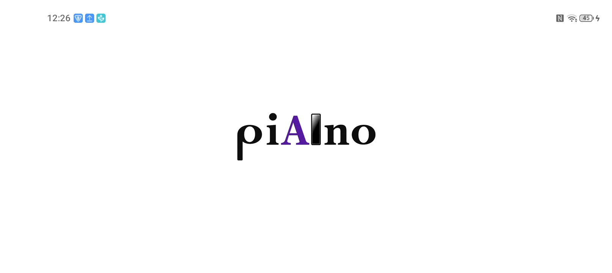
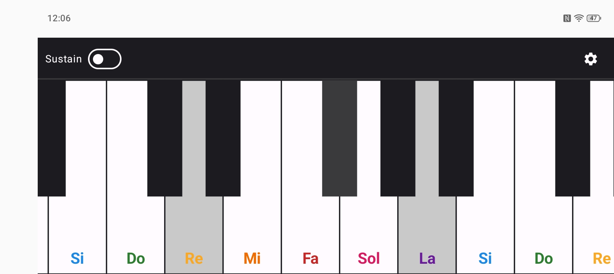
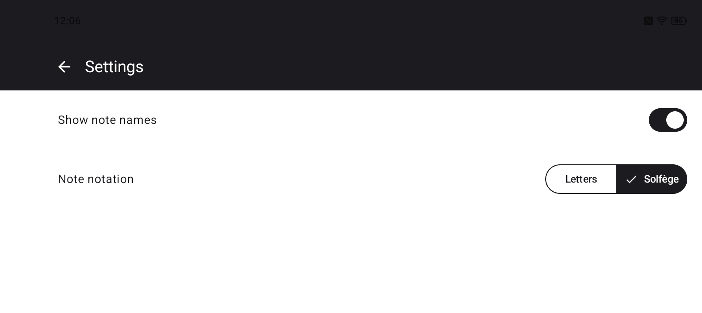
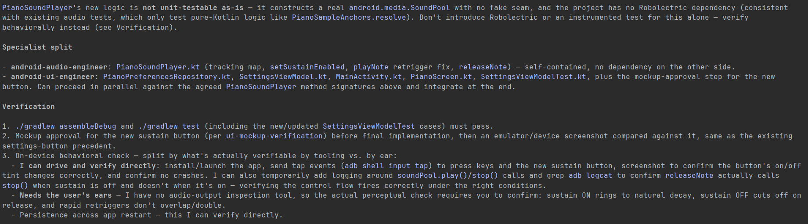
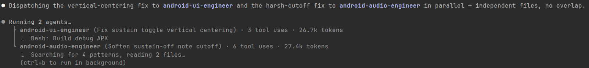
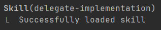
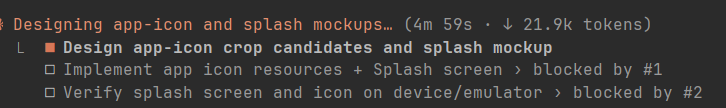
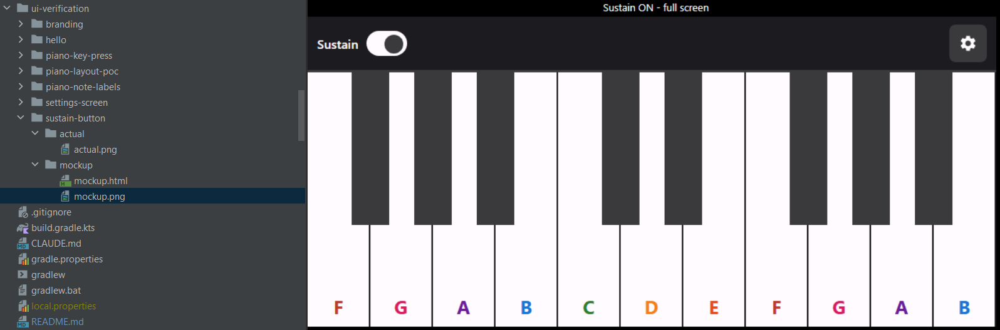
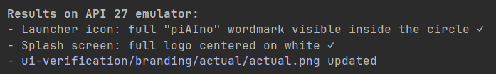

# piAIno

A virtual piano for Android. Play all 88 keys, scroll across octaves, and switch between letter and solfège notation - with realistic sampled sound and a sustain mode that mirrors a real piano pedal.

Built as a project for the **AI Assisted Development** course, part of the **AI for Developers module** at [SoftUni](https://ai.softuni.bg/).


---

## Install

Download the APK from the [Releases](https://github.com/simona114/piAIno/releases) page and open it on your Android device. You will need to allow installation from unknown sources.

---

## Features

- **88-key piano keyboard** - full range from A0 to C8, horizontally scrollable
- **Realistic sound** - 30 recorded grand piano samples, pitch-shifted to cover every key
- **Polyphony** - hold or rapid-press multiple keys without notes cutting each other off
- **Sustain mode** - notes ring after release, just like a sustain pedal
- **Note labels** - toggle note names on the white keys, in letter (C, D#) or solfège (Do, Re#) notation
- **Low-latency audio** - routed through Android's fast audio path for immediate response to touch

---

## Screenshots/Videos

### Demo

https://github.com/simona114/piAIno/raw/master/documentation/videos/piAIno-Demonstration.mp4

### Splash screen


### Piano


### Settings


---

## Tech Stack

| Layer | Technology |
|---|---|
| Language | Kotlin |
| UI | Jetpack Compose |
| Architecture | MVVM |
| Navigation | Compose Navigation (typed routes) |
| Audio | SoundPool (USAGE_GAME, fast mixer path) |
| Preferences | SharedPreferences |

---

## Architecture

The app is split into three logical modules (packages within a single Gradle module):

**Presentation** - Compose screens (Splash, Piano, Settings), ViewModels, and the custom Canvas-drawn keyboard. The keyboard is drawn as a single Canvas rather than per-key composables to support smooth scrolling, black-key overlap, and simultaneous multi-touch at scale.

**Piano Domain** - Pure Kotlin, no Android imports. Owns the 88-key layout, note naming in both notation systems, pitch-shift rate math, and user preferences. Both the UI and audio layers depend on this; neither depends on the other.

**Audio Playback** - Loads the 30 anchor samples asynchronously on startup (center octave first, so the visible viewport is playable immediately), resolves any key press to its nearest anchor, and pitch-shifts via SoundPool playback rate. Manages polyphonic voice lifecycle, sustain fade-out, and thread safety between the binder-thread load callbacks and main-thread playback calls.

---

## AI Customizations & Automations

The project was developed using [Claude Code](https://claude.ai/code) with several customizations that shaped the workflow.

### Specialist sub-agents

Two domain-specific agents were configured - `android-ui-engineer` and `android-audio-engineer` - each scoped to its own module. They could be dispatched for focused code review or implementation work, and run in parallel when the tasks were independent.





### Skills

Reusable skills were set up for recurring workflows: splitting uncommitted changes into atomic commits, verifying UI against mockups, and delegating implementation tasks. A skill is invoked by name and runs a predefined sequence of steps.



### Task planning

For multi-step work, Claude Code broke the plan into tracked subtasks with explicit blocking relationships - a task depending on another could not start until its dependency was resolved.



### Prompt logging hook

A hook was configured to log every prompt I sent during a session to a local JSON file, so I could personally review and analyse my prompting patterns across the project. Example entries:

```
{"session_id":"397a080f-0cf6-4cb1-9f8b-66731362bb60","permission_mode":"plan","hook_event_name":"UserPromptSubmit","prompt":"Analyse the generated system architecture modules and responsibilities and create only the subagents that are truly needed for this project. Before generating the files, explain why each subagent is needed, and proceed only after approval. Use the starter template and recommendations from: https://github.blog/ai-and-ml/github-copilot/how-to-write-a-great-agents-md-lessons-from-over-2500-repositories/"}
{"session_id":"cdc36c9a-a64b-4df8-aee5-f2143eda9b18","permission_mode":"plan","hook_event_name":"UserPromptSubmit","prompt":"I want to implement the next step - Where clicking on a key would produce the actual sound of the key. The sounds for each key would need to be downloaded and stored in the project first"}
{"session_id":"32df254f-9ca5-4a87-b58f-745ec2e8f0ad","permission_mode":"plan","hook_event_name":"UserPromptSubmit","prompt":"I want to build the feature about showing the note names on the bottom of the white keys. I imagine they will be colorful, e.g use purple for note A, use green, red, pink, blue for the rest and so on. I want only the note names on the white keys, I don't want the octave number. Showing the note names for now won't be controlled by preferences screen - note names will be always shown"}
{"session_id":"cdc36c9a-a64b-4df8-aee5-f2143eda9b18","permission_mode":"auto","hook_event_name":"UserPromptSubmit","prompt":"Can we create tests that ensure that for the key we pressed, we would use a proper sound and pitching, for black and white keys"}
```

### Emulator verification

For visual work (app icon, splash screen), the agent first crated an HTML mockup, took a screenshot on a headless browser, requested approval before proceeding with implementation. Then took a screenshot from a running emulator and compared the two automatically, reporting pass/fail per element and storing the result screenshot





---

## Biggest Challenge

Logo generation required the most model comparisons and iterations of anything in the project. The concept required specific letters in "piAIno" to each mimic a musical symbol: a quarter note for **p**, the note name **A**, a black piano key for **i**, and a whole note for **o**, rendered in a music-notation style font.

Claude Sonnet and Gemini were both tried first. Neither matched the concept: both consistently generated an eighth note instead of a quarter note, and instead of a standalone black key they included the surrounding white keys. Rephrasing the prompts and providing reference images did not help. GPT-5.5 was tried next and produced the intended design after a few iterations.

---

## Sound Samples

Piano sounds are from the **Salamander Grand Piano** by Alexander Holm, licensed under [CC BY 3.0](https://creativecommons.org/licenses/by/3.0/).

- Original recordings: [archive.org/details/SalamanderGrandPianoV3](https://archive.org/details/SalamanderGrandPianoV3)
- Packaged via: [darosh/samples-piano-mp3](https://github.com/darosh/samples-piano-mp3)

30 of the 88 keys are directly recorded; the remaining 58 are pitch-shifted from the nearest recorded sample, never more than ~1.5 semitones away.

---
